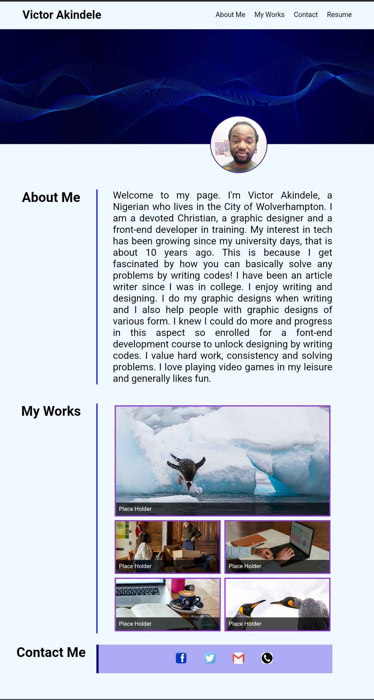

# My Portfolio

## Description
This is a website describing my profile and portfolio.
## Installation
N/A
## Usage
To access this webpage, simply click on this link https://hurlavic.github.io/my-portfolio/. It's a single webpage where you can see my profile, including my recent works and my contact details. For quick acces to these sections of the page, click on the navigation links at the nav-bar and the UI scrolls to desired section.

## Mockup 
Below is the appearance of the web application.

## Credits
N/A
## License
Pls refer to license in repo.